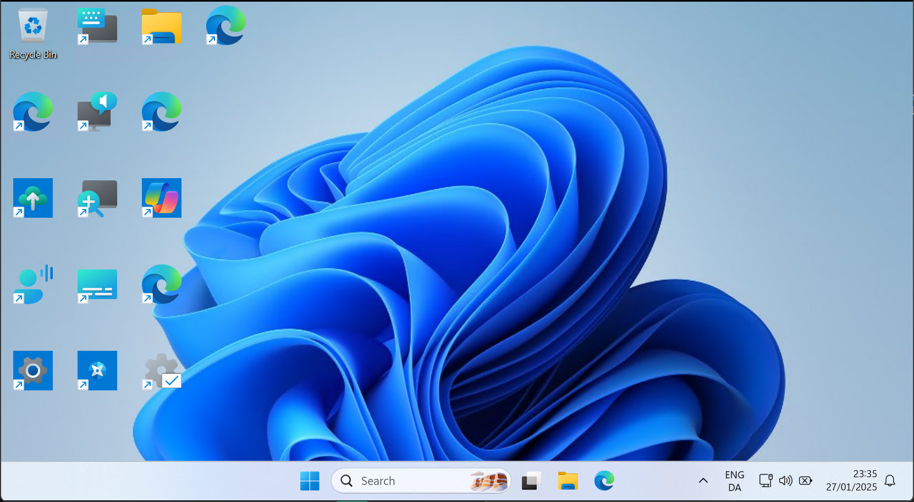
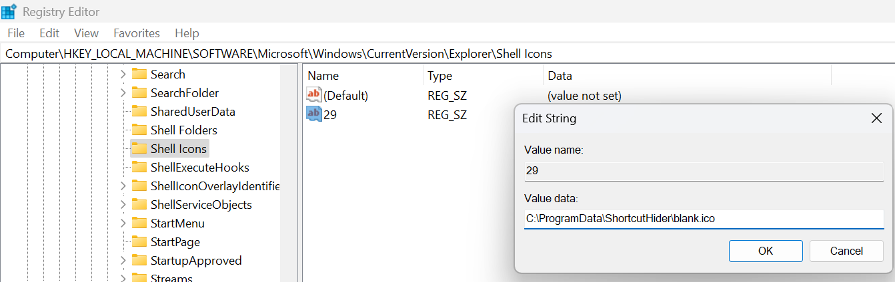

# ShurtcutTitleRemover
PowerShell script that removes the names of the icons on your desktop and hides shortcut arrows.


To run script open PowerShell and paste:

```irm https://raw.githubusercontent.com/BenjaminEwe/ShurtcutTitleRemover/refs/heads/main/ShortcutNameHider.ps1 | iex```

## Results
<details>
<summary>Images of some of the possible configurations</summary>

Remove titles of shortcuts:

Remove Arrows

Remove Titles and Arrows

Remove Titles, Arrows, and Recycle Bin name


</details>

## How to undo
Just copy the backed up files to the desktop folders and delete the renamed ones

Backup location for the useraccounts shortcuts: %USERPROFILE%/DesktopBackup

Backup location for the public (shared) shortcuts: %Public%/Desktopbackup

## Notes

### Shortcut renaming
The script works by renaming the files to invisible characters. Feel free to open an issue if you have a more elegant solution.
A backup is made of all files before modifying them to make it easier to undo.

### Shortcut arrow
Many guides recommend setting the shortcut icon to ```%windir%\System32\shell32.dll,-50```
While this often works largely fine it can cause the iconcache.db to corrupt. This can lead to the shortcut arrow being replaced by a giant black box, or shortcuts losing their icons instead becoming blank files. Setting it to a custom blank icon seems to be more stable.


## How to do these things manually
### Remove shortcut name
Copy an invisible character like this one: ```ㅤ ```

Start renaming shortcuts one by one with an increasing amount of invisible characters

### Remove the shortcut arrow
1. Download a blank .ico file ([Like this one](Images/Blank.ico)) and place it somewhere it can stay permanently

2. Go to the registry key "HKLM:\SOFTWARE\Microsoft\Windows\CurrentVersion\Explorer\"

3. Make a new key under that called "Shell Icons"

4. In that key, make a new string with the name "29". Set the value to the location for the image. 

5. Log out an in again or restart computer (or restart explorer.exe)



### Remove the UAC icon from shortcuts
TBD

### Remove the name of the recycling bin
Right-click the recycling bin, rename, press space, done

### Remove the recycling bin
1. Open settings>Themes (or press [here](ms-settings:themes))

2. Press "Desktop Icon Settings"

3. Uncheck Recycle Bin