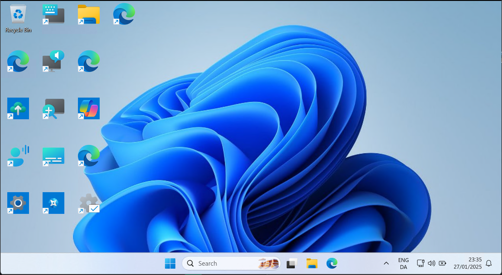

# ShurtcutTitleRemover
PowerShell script that can remove the:
- Names of shortcuts
- Shortcut arrow
- Name of the recycle bin
- Recycle bin from desktop

To run script open PowerShell and paste:

```irm https://raw.githubusercontent.com/BenjaminEwe/ShurtcutTitleRemover/refs/heads/main/ShortcutNameHider.ps1 -OutFile $env:TEMP\SCTR.ps1; & $env:TEMP\SCTR.ps1```


## ExecutionPolicy

If you get an error like this:


You need to run powershell as administrator and run the command ``Set-ExecutionPolicy RemoteSigned`` and press yes.


## Results
<details>
<summary>Images of some of the possible configurations</summary>

Remove titles of shortcuts:

Remove Arrows

Remove Titles and Arrows

Remove Titles, Arrows, and Recycle Bin name


</details>

## How to undo
[Manual Restore wiki page](https://github.com/BenjaminEwe/ShortcutTitleRemover/wiki/Manual-Restore)

## How does it work
[Functionality wiki page](https://github.com/BenjaminEwe/ShortcutTitleRemover/wiki/Functionality)


## How to do these things manually
[Do it manually](https://github.com/BenjaminEwe/ShortcutTitleRemover/wiki/Do-it-manually)
